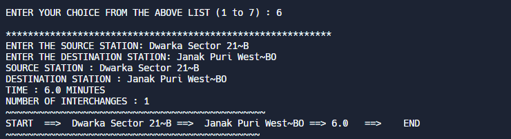

# The Metro App

This is a simple Java program that will take information of the source station and the destination station, of Delhi Metro, from the user and display the fare and shortest metro route to reach the destination. It will also be having a metro map for commuter’s better navigation.

  

  

  

  

The idea is implemented using Graph and Heap data structures.
The graph has nodes and edges. Nodes represent a metro station that will be containing certain information regarding that station like its name, its metro corridor, and the lines which it connects. Edges (the connection between two nodes) represent the distance between the two stations and the cost of each edge will be equal to the distance between the two of its connecting stations(nodes). 

By using different algorithms like Dijkstra, breadth-first search, depth-first search, etc, the shortest path between the source station and the destination station is determined, and accordingly, the fare is being calculated on the basis of the total distance between the two stations. Finally, the metro route between the two stations and the total fare is displayed.

Graph_M.java cointains all the major code and Heap.java contains heap implementation.

##  REQUIREMENTS

> The project can run on any online or offline Integrated Development Environment (IDE) like Eclipse, Netbeans, ideone.com, VSCode, etc..
> You should have at least elementary knowledge of Java Programming language to work on the project.
> Knowledge of data structures like Graph and Heap and Algorithms like Dijkstra, BFS, DFS, etc is appreciated, however, it is not essential.
> And lastly, some understanding of the Collection framework makes it a cakewalk journey. 
